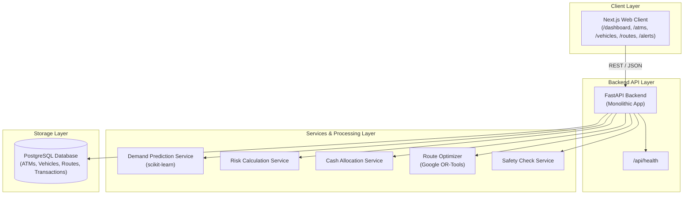

# CashRouteAI Architecture Overview

## System Overview

CashRouteAI is an intraday ATM cash optimization and Cash-In-Transit (CIT) route planning system. It is structured as a modular monolith composed of:
1. **Frontend**: Next.js App Router (TypeScript)
2. **Backend**: FastAPI (Python)
3. **Database**: PostgreSQL
4. **Machine Learning Pipeline**: scikit-learn for demand prediction
5. **Optimization Engine**: OR-Tools for routing & time windows

---

## High-Level Architecture Diagram

---

## Planned Directory Responsibilities

- **`frontend/app/`**: Next.js App Router pages and navigation.
- **`frontend/components/`**: Reusable UI components (ATM status cards, interactive maps, metrics).
- **`backend/app/api/`**: FastAPI route handlers.
- **`backend/app/models/`**: Database models (ORM/declarative).
- **`backend/app/schemas/`**: Pydantic validation and serialization models.
- **`backend/app/services/`**: Business logic, ML inference hooks, and routing solvers.
- **`backend/ml/`**: Model training, artifact storage, and feature pipelines.
- **`database/`**: SQL schema and initial seed fixtures.
